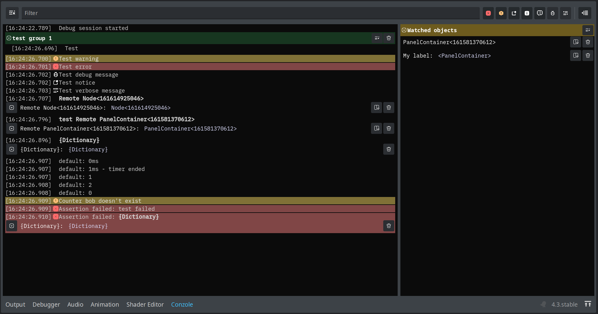

# Conzole log helper


Conzole is a web browser console-inspired logger addon designed to make it easier and more fun to utilize the Godot debugger log. The plugin lets you log messages and data from your game into a rich editor log.

Features include:
* **Browser-console compatible(*) API:** Instantly familiar syntax for anyone used to web development. 
* **Detailed object dumping:** When you want to inspect or look at a variable, log it to the Conzole for a detailed look at its properties
* **Object parking log:** Add any objects to the watch list for quick access to open it in the inspector
* **Rich text formatting:** Format your log output with shortcut formatting options for bold or colorized output. Full BBCode supported.
* **Grouped log output:** Extending the browser console grouping API with the ability to colorize and rename groups
* **Log limits per group:** Restrict number of log lines per group so you only get the most recent entries. Super useful for long running tasks such as game loops or timers.
* **6 log levels:** Output logs in any level you want and use the built-in toggler to only show specific log levels
* **Filterable output:** Built-in filtering to quickly find specific log items

*( * Browser console compatible ):* Some slight adjustments have been made to the method syntaxes and arguments to make them work in Godot. Most importantly is that instead of using
```javascript
console.log("Item 1", "Item 2")
```
like you would do in javascript, `Conzole` uses an array as its main argument, to allow logging multiple items:
```gdscript
Conzole.log(["Item 1", "Item 2"])
```

In addition to this, the `console.assert()` method has been named `Conzole.assertion()` because `assert` is a reserved Godot keyword.

## Getting started
### Installation
#### Manual installation
Download the code, then place the `conzole` folder inside your project's `addons/` folder.

#### Assetlib
* Install from Godot AssetLib
* Open Project settings -> Plugins
* Enable the `Conzole` plugin and reload your project

#### IMPORTANT: Autoloading
Conzole adds an autoloaded singleton to your project when its enabled. If you want to use Conzole to log in any of your project singletons, make sure the Conzole singleton is loaded before the other project singletons. You can do this by moving the Conzole singleton to the top from Project settings -> Globals.

## Usage

After enabling the plugin you will find it in the `Conzole` tab at the bottom of the editor. Start using it by logging to the Conzole from anywhere in your code. Here are some examples to get you started (you can find more in the `self_test()` method inside the `Conzole` class):

## Examples
```gdscript
# Logs "Test" to the conzole output
Conzole.log("Test")

# Logs the message "Grouped message" to the conzole output, inside a group named "Group 1"
Conzole.log("Grouped message", "Group 1")

# Logs the message "Sub-grouped message" to the conzole output, 
# inside a group named "Group 1-1", inside the group "Group 1"
Conzole.group("Sub-grouped message", "Group 1/Group 1-1")

# Logs two messages to the conzole output
Conzole.log(["Message 1", "Message 2"])

# Logs a warning (does not log to the main output log)
Conzole.warn("Test warning")

# Logs an error (does not log to the main output log)
Conzole.err("Test error")

# Logs a message with level "debug"
Conzole.debug("Test debug message")

# Logs a message with level "notice"
Conzole.notice("Test notice")

# Logs a message with level "verbose"
Conzole.verbose("Test verbose message")

# Logs a blue, bold message to the conzole
var msg = ConzoleFormattedText.message("test").bold().color(Color.BLUE)

# Logs the message "Test panel contents" and shows the contents 
# of the `test_panel` variable in an expandable view
var test_panel = PanelContainer.new()
Conzole.log(["Test panel contents", test_panel])

# Adds the test_panel object to the watch list
Conzole.watch(test_panel)

# Adds the test_panel object to the watch list with a custom label
Conzole.watch(test_panel, "A panel to watch")

# Logs the contents of the passed in dictionary in an expandable view
Conzole.log({ "dictionary_key_1": "one", "dictionary_key_2": 1, "dictionary_key_3": false, "dictionary_key_4": ["one", "two", "three"], "dictionary_key_5": { "object_key_1": 1, "object_key_2": Vector2(1, 1) } })

# Starts a timer
Conzole.time("My timer")

# Logs the time
await get_tree().create_timer(.26).timeout
Conzole.timeLog("My timer")

# Stops the timer
Conzole.timeEnd("My timer")

# Starts a counter and counts, including printing the current value
Conzole.count("My first counter")
Conzole.count("My second counter")
Conzole.count("My first counter")
Conzole.count("My first counter")
Conzole.count("My second counter")
Conzole.count("My second counter")

# Resets the counter for a specific counter
Conzole.countReset("bob")

# Prints an error to the conzole if the first parameter evaluates to false
# Using either string substition and a list of parameters to substitute
Conzole.assertion(false, "%s failed", ["test"])
# or an object that will be shown in an expandable view
Conzole.assertion(false, {"error": "test failed"})
```

For more examples and explanation on how these methods can be used, see the
browser console documentation at https://developer.mozilla.org/en-US/docs/Web/API/console